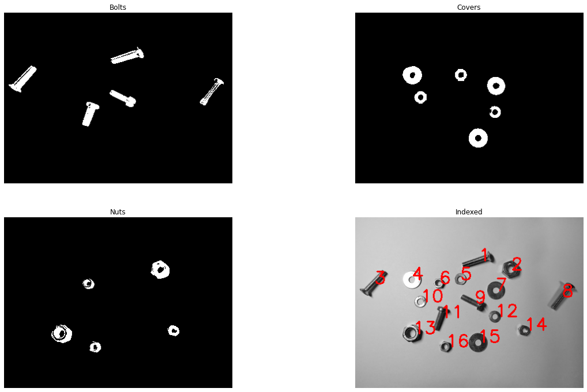

# naive-image-classification
Object classification with basic computer vision techniques.

Final assignment for the computer vision course I took at university. 
The task was to classify objects in a picture using any tools we learned during the course. 
I used histogram equalization, Otsu thresholding, image dilation and other morphological operators for preprocessing 
and OpenCV's connected component labelling function for classifying objects according to their Hu moments. 

